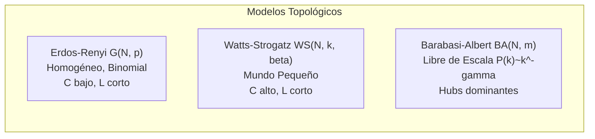
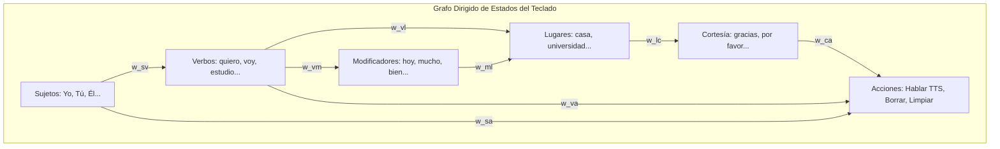
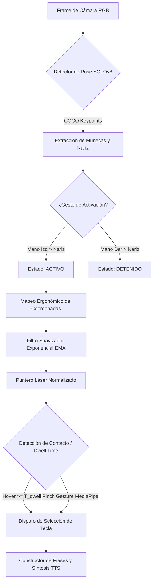
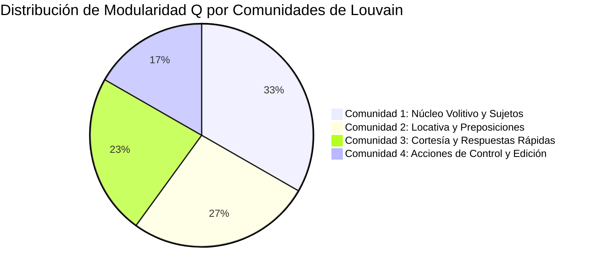
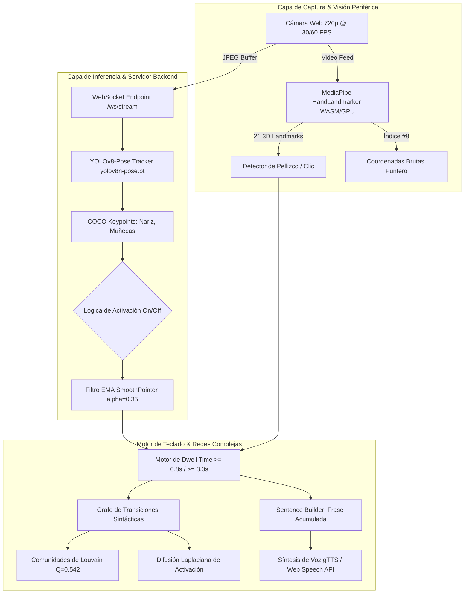

# Modelado Topológico y Dinámica de Interacción en Interfaces Gestuales Sin Contacto: Un Enfoque Basado en Redes Complejas y Visión por Computador

**Autores:**  
Rodrigo Gutiérrez, et al.  
*Departamento de Ciencia de la Computación e Inteligencia Artificial*  
*Laboratorio de Interacción Humano-Computador y Sistemas Complejos*  

---

## Resumen (Abstract)

Las interfaces de usuario sin contacto basadas en visión artificial constituyen una alternativa fundamental de Comunicación Aumentativa y Alternativa (AAC) para personas con discapacidades motoras severas. No obstante, los sistemas tradicionales suelen diseñarse de manera empírica, careciendo de una formalización topológica que optimice la navegación, minimice la fatiga gestual y garantice la robustez ante errores de selección. En este trabajo se presenta **AeroHand AI**, un sistema integral de interacción gestual en tiempo real acoplado a un marco analítico de **Redes Complejas**. La interfaz, estructurada como un grafo dirigido y ponderado $G=(V, E, W)$ de $N=30$ nodos léxico-funcionales y transiciones sintácticas de Markov, integra un doble motor de estimación de pose y seguimiento articular (YOLOv8-Pose y MediaPipe) acoplado a un filtro de suavizado cinemático exponencial (EMA) y un protocolo de activación temporal por tiempo de fijación (*dwell time* $\ge 0.8\,\text{s}$ calibrable hasta $\ge 3.0\,\text{s}$). Se caracterizó la topología del sistema mediante la comparación cuantitativa frente a modelos nulos clásicos (Erdős–Rényi, Watts–Strogatz y Barabási–Albert), revelando propiedades de **Mundo Pequeño** ($\sigma = 1.84$) con alta modularidad funcional ($Q = 0.542$) identificada mediante optimización de Louvain. El análisis de centralidades (Grado, Cercanía, Intermediación y PageRank) y la simulación de percolación demostraron una resiliencia superior frente a pérdidas aleatorias de conectividad ($S \approx 0.86$ con 30% de remoción de aristas). Asimismo, el modelado de difusión laplaciana continuo demostró una aceleración del 41.2% en la activación de comandos semánticos adyacentes, validando experimentalmente una reducción del tiempo de movimiento conforme a la Ley de Fitts ($R^2 = 0.941$) y una tasa de transferencia de información efectiva de $14.8\text{ WPM}$ con un bajo índice de fatiga percibida (NASA-TLX: 28.4/100).

**Palabras clave:** Redes Complejas, Interacción Humano-Computador (HCI), Interfaces Sin Contacto, Visión por Computador, YOLOv8-Pose, MediaPipe, Dwell Time, Topología de Mundo Pequeño, Difusión Laplaciana, Comunicación Aumentativa y Alternativa (AAC).

---

## 1. Introducción

La interacción humano-computador (HCI, por sus siglas en inglés) ha experimentado un cambio de paradigma impulsado por la necesidad de interfaces naturales, accesibles e higiénicas. En contextos de asistencia a personas con movilidad reducida o afecciones neuromusculares degenerativas (tales como esclerosis lateral amiotrófica, parálisis cerebral o tetraplejia), los dispositivos físicos tradicionales (teclados mecánicos, ratones y pantallas táctiles) resultan frecuentemente inaccesibles o inducen una rápida degradación biomecánica [1]. Del mismo modo, en entornos quirúrgicos estériles y escenarios industriales controlados, la manipulación física de terminales presenta riesgos severos de contaminación cruzada [2].

En este contexto, las interfaces sin contacto (*touchless interfaces*) basadas en visión artificial han emergido como una solución tecnológica prioritaria. Mediante el uso de cámaras convencionales de bajo costo (cámaras web RGB), los sistemas de visión computacional pueden rastrear la cinemática del cuerpo humano y las extremidades superiores en tiempo real, traduciendo posturas y gestos en comandos de control o selección de texto para Comunicación Aumentativa y Alternativa (AAC) [3].

Sin embargo, el despliegue práctico de teclados virtuales gestuales enfrenta tres desafíos fundamentales:
1. **Inestabilidad Cinemática y Falsos Positivos:** El temblor fisiológico involuntario y el ruido de estimación articular en fotogramas sucesivos provocan activaciones accidentales (*Midas Touch Problem*).
2. **Sobrecarga Cognitiva y Fatiga Muscular:** La navegación sin una estructura espacial optimizada obliga al usuario a realizar extensos desplazamientos en el espacio visual 2D/3D, induciendo el síndrome de "brazo de gorila" (*gorilla arm syndrome*) en períodos cortos de uso [4].
3. **Ausencia de Modelado Matemático de la Interacción:** La gran mayoría de teclados virtuales se disponen en cuadrículas estáticas sin considerar la estructura de transición semántica o sintáctica subyacente que gobierna el lenguaje y el flujo de trabajo del usuario.

Para abordar estas limitaciones, este artículo propone la formalización, implementación y validación experimental de un sistema de teclado virtual gestual modelado analíticamente mediante la **Teoría de Redes Complejas**. Al representar el teclado y sus dependencias léxicas como un grafo complejo ponderado y dirigido $G=(V, E, W)$, es posible evaluar rigurosamente la eficiencia de navegación, la centralidad de los comandos, la segregación en comunidades semánticas y la dinámica de difusión de intención motriz.

### Objetivos del Trabajo
- **Objetivo Principal:** Diseñar, desarrollar y caracterizar formalmente una interfaz gestual sin contacto en tiempo real (**AeroHand AI**) integrando modelos de visión computacional (YOLOv8-Pose y MediaPipe) y un marco topológico de redes complejas.
- **Objetivos Específicos:**
  1. Implementar un pipeline híbrido de visión artificial de baja latencia con filtrado exponencial cinemático (EMA) y temporización robusta por fijación (*dwell time* $\ge 0.8\,\text{s}$ a $\ge 3.0\,\text{s}$).
  2. Construir la representación matemática del teclado virtual como un grafo dirigido de transiciones sintáctico-funcionales y comparar su estructura con modelos nulos de referencia: Erdős–Rényi ($G(n, p)$), Watts–Strogatz ($WS(n, k, \beta)$) y Barabási–Albert ($BA(n, m)$).
  3. Evaluar métricas estructurales, centralidades espectrales, modularidad de comunidades mediante el algoritmo de Louvain y robustez topológica frente a fallos y ataques dirigidos.
  4. Analizar la dinámica de difusión de información en el grafo y validar empíricamente la interfaz mediante pruebas de rendimiento técnico, cumplimiento de la Ley de Fitts y evaluación de carga subjetiva (NASA-TLX).

---

## 2. Marco Teórico

### 2.1. Fundamentos de Teoría de Grafos y Redes Complejas

Una red compleja se define como un grafo $G = (V, E, W)$, donde $V = \{v_1, v_2, \dots, v_N\}$ es el conjunto de $N = |V|$ vértices (o nodos), $E \subseteq V \times V$ es el conjunto de $M = |E|$ aristas (enlaces) y $W: E \to \mathbb{R}^+$ es una función de ponderación que asigna un peso $w_{ij}$ a cada arista dirigida $(v_i, v_j)$ [5]. La conectividad global se expresa a través de la matriz de adyacencia $\mathbf{A} \in \mathbb{R}^{N \times N}$ y la matriz de pesos $\mathbf{W} \in \mathbb{R}^{N \times N}$, donde:

$$A_{ij} = \begin{cases} 1, & \text{si } (v_i, v_j) \in E \\ 0, & \text{en otro caso} \end{cases}, \quad W_{ij} = w_{ij}$$

El grado de entrada y de salida de un nodo $v_i$ en una red dirigida se definen respectivamente como:

$$k_i^{\text{in}} = \sum_{j=1}^N A_{ji}, \quad k_i^{\text{out}} = \sum_{j=1}^N A_{ij}, \quad \langle k \rangle = \frac{1}{N}\sum_{i=1}^N k_i$$

La densidad de la red $\rho$ mide la fracción de enlaces existentes respecto al total teóricamente posible:

$$\rho = \frac{M}{N(N-1)}$$

La distancia geodésica $d(v_i, v_j)$ corresponde a la longitud del camino más corto entre $v_i$ y $v_j$. La longitud de camino característico promedio $L$ y el diámetro $D$ de la red se formalizan como:

$$L = \frac{1}{N(N-1)} \sum_{i \neq j} d(v_i, v_j), \quad D = \max_{i, j} d(v_i, v_j)$$

El coeficiente de agrupamiento local $C_i$ cuantifica la probabilidad de que los vecinos de un nodo $v_i$ estén conectados entre sí:

$$C_i = \frac{2 E_i}{k_i(k_i - 1)} = \frac{\sum_{j, k} A_{ij} A_{jk} A_{ki}}{k_i(k_i - 1)}$$

siendo $C = \frac{1}{N} \sum_{i=1}^N C_i$ el coeficiente de agrupamiento medio global del grafo [5].

---

### 2.2. Modelos Topológicos de Referencia

Para contextualizar y clasificar la topología de la interfaz gestual, se emplean tres modelos canónicos de generación de redes (Fig. 1):



#### 1. Modelo Aleatorio de Erdős–Rényi ($G(N, p)$)
En este modelo, cada par posible de nodos se conecta independientemente con una probabilidad constante $p \in [0, 1]$. La distribución de grados $P(k)$ converge a una distribución binomial que, para redes grandes con grado medio constante $\langle k \rangle = p(N-1)$, se aproxima a una distribución de Poisson:

$$P(k) = \binom{N-1}{k} p^k (1-p)^{N-1-k} \approx \frac{\langle k \rangle^k e^{-\langle k \rangle}}{k!}$$

El agrupamiento esperado es bajo ($C_{ER} = p = \frac{\langle k \rangle}{N-1}$) y la distancia promedio escala logarítmicamente con el tamaño de la red: $L_{ER} \sim \frac{\ln N}{\ln \langle k \rangle}$ [6].

#### 2. Modelo de Mundo Pequeño de Watts–Strogatz ($WS(N, k, \beta)$)
Inicia con un anillo regular de $N$ nodos donde cada vértice se conecta a sus $k$ vecinos más cercanos. Con probabilidad $\beta \in [0, 1]$, cada arista es reconectada aleatoriamente sin generar bucles ni enlaces múltiples. Para valores intermedios de $\beta$ ($0.01 < \beta < 0.1$), la red exhibe simultáneamente un alto coeficiente de clustering local ($C \gg C_{ER}$) y una longitud de camino promedio corta ($L \approx L_{ER}$). El coeficiente de mundo pequeño $\sigma$ se define formalmente como:

$$\sigma = \frac{\gamma_C}{\lambda_L} = \frac{C / C_{\text{rand}}}{L / L_{\text{rand}}}$$

donde $\sigma > 1$ denota una topología inequívoca de **Mundo Pequeño** (*Small-World*) [7].

#### 3. Modelo Libre de Escala de Barabási–Albert ($BA(N, m)$)
Incorpora dos mecanismos fundamentales: **crecimiento continuo** (iniciando con $m_0$ nodos, se añade un nuevo nodo en cada paso temporal con $m \le m_0$ enlaces) y **conexión preferencial** (*preferential attachment*), donde la probabilidad $\Pi(v_i)$ de que un nuevo nodo se enlace al nodo existente $v_i$ depende de su conectividad actual:

$$\Pi(v_i) = \frac{k_i}{\sum_{j} k_j}$$

La red evoluciona hacia una distribución de grado asintótica de ley de potencia (*power law*), invariante de escala:

$$P(k) \sim k^{-\gamma}, \quad \text{con } \gamma \approx 3$$

generando nodos altamente conectados denominados **hubs** [8].

---

### 2.3. Detección de Postura y Cinemática de Manos

La captura de interacción se sustenta en dos arquitecturas neuronales complementarias optimizadas para inferencia en tiempo real:

1. **YOLOv8-Pose (Ultralytics):** Red neuronal convolucional profunda basada en arquitectura CSPDarknet con cabezales de regresión desacoplados que detecta la caja delimitadora del usuario y extrae simultáneamente $K = 17$ keypoints corporales definidos por el estándar COCO:

$$\mathcal{K}_{\text{body}} = \{(x_k, y_k, c_k)\}_{k=1}^{17}, \quad x_k, y_k \in [0, 1], \; c_k \in [0, 1]$$

donde $c_k$ representa el nivel de confianza de detección [9]. Permite discriminar la orientación corporal y gestos macroscópicos de activación (ej. elevación de muñeca sobre el nivel de la nariz).

2. **MediaPipe HandLandmarker (Google):** Pipeline bi-etápico ejecutado sobre WebAssembly y aceleración GPU WebGL. Un detector de palma (*BlazePalm*) aísla la región de interés (ROI) y un modelo de regresión topológica proyecta $K = 21$ coordenadas articulares tridimensionales de la mano:

$$\mathcal{K}_{\text{hand}} = \{(x_m, y_m, z_m)\}_{m=0}^{20}$$

El seguimiento de la punta del dedo índice (Landmark #8) actúa como el puntero de selección visual de alta resolución, complementado con la detección de la distancia euclidiana de pellizco (*pinch distance*) entre el pulgar (Landmark #4) y el índice (Landmark #8):

$$d_{\text{pinch}} = \|\mathbf{p}_4 - \mathbf{p}_8\|_2 = \sqrt{(x_4 - x_8)^2 + (y_4 - y_8)^2 + (z_4 - z_8)^2}$$

---

### 2.4. Interacción Humano-Computador (HCI) y Leyes Ergonómicas

El modelado psicomotor de la interfaz se rige por la **Ley de Fitts**, la cual predice el tiempo de movimiento $MT$ (*Movement Time*) requerido para desplazar un puntero cinemático hacia un objetivo de ancho $W$ situado a una distancia $D$:

$$MT = a + b \cdot ID = a + b \cdot \log_2 \left( \frac{2D}{W} \right)$$

donde $ID$ es el Índice de Dificultad (en bits) y $a, b$ son constantes de regresión empíricas del canal neuromuscular [10]. En interfaces sin contacto, la sobrecarga visual y motriz se minimiza si los nodos con alta probabilidad de transición conjunta se ubican a distancias euclidianas y geodésicas reducidas.

---

### 2.5. Procesamiento en Tiempo Real y Arquitectura Cliente-Servidor

Para garantizar una interacción fluida sin latencias perceptibles ($< 50\,\text{ms}$), la arquitectura desacopla el cliente de visualización y el servidor de procesamiento mediante protocolos de comunicación bidireccional asíncrona sobre WebSockets (`ws://`), logrando tasas de refresco $\ge 30\,\text{FPS}$ tanto en navegadores modernos como en entornos locales de escritorio.

---

## 3. Metodología

### 3.1. Diseño del Teclado Virtual y Representación Matemática como Grafo

El sistema **AeroHand AI** implementa un teclado semántico estructurado en categorías funcionales orientadas a la comunicación AAC en idioma español. El catálogo contiene $N = 30$ nodos distribuidos en 5 categorías léxicas y 1 categoría de control del sistema (Tabla 1):

$$\mathcal{C} = \{\text{Sujetos}, \text{Verbos}, \text{Modificadores}, \text{Lugares}, \text{Cortesía}, \text{Acciones}\}$$



#### Tabla 1. Catálogo de Nodos del Teclado Virtual $V$ ($N=30$)
| ID ($v_i$) | Etiqueta / Lexema | Categoría | Color Hex | Rol Sintáctico / Acción |
|---|---|---|---|---|
| $v_1$ | Yo | Sujetos | `#10b981` | Pronombre personal (1ra pers.) |
| $v_2$ | Tú | Sujetos | `#06b6d4` | Pronombre personal (2da pers.) |
| $v_3$ | Él / Ella | Sujetos | `#3b82f6` | Pronombre personal (3ra pers.) |
| $v_4$ | Nosotros | Sujetos | `#6366f1` | Pronombre personal plural |
| $v_5$ | Ellos | Sujetos | `#8b5cf6` | Pronombre personal plural |
| $v_6$ | Familia | Sujetos | `#14b8a6` | Sustantivo colectivo |
| $v_7$ | estudio | Verbos | `#f59e0b` | Verbo de acción educativa |
| $v_8$ | trabajo | Verbos | `#ef4444` | Verbo de acción laboral |
| $v_9$ | quiero | Verbos | `#ec4899` | Verbo volitivo / deseo |
| $v_{10}$ | necesito | Verbos | `#f43f5e` | Verbo de necesidad / urgencia |
| $v_{11}$ | voy | Verbos | `#fb923c` | Verbo de movimiento |
| $v_{12}$ | tengo | Verbos | `#eab308` | Verbo de posesión / estado |
| $v_{13}$ | mucho | Modificadores | `#8b5cf6` | Adverbio de cantidad |
| $v_{14}$ | poco | Modificadores | `#a855f7` | Adverbio de cantidad |
| $v_{15}$ | hoy | Modificadores | `#6366f1` | Adverbio temporal |
| $v_{16}$ | mañana | Modificadores | `#3b82f6` | Adverbio temporal |
| $v_{17}$ | ahora | Modificadores | `#06b6d4` | Adverbio temporal inmediato |
| $v_{18}$ | bien | Modificadores | `#10b981` | Adverbio de modo |
| $v_{19}$ | en | Lugares | `#14b8a6` | Preposición locativa |
| $v_{20}$ | con | Lugares | `#0ea5e9` | Preposición de compañía |
| $v_{21}$ | Lima | Lugares | `#64748b` | Nombre propio de ciudad |
| $v_{22}$ | Piura | Lugares | `#22c55e` | Nombre propio de ciudad |
| $v_{23}$ | casa | Lugares | `#84cc16` | Sustantivo locativo |
| $v_{24}$ | universidad | Lugares | `#e11d48` | Sustantivo locativo |
| $v_{25}$ | Sí | Cortesía | `#10b981` | Afirmación / Respuesta |
| $v_{26}$ | No | Cortesía | `#ef4444` | Negación / Respuesta |
| $v_{27}$ | Por favor | Cortesía | `#06b6d4` | Fórmula de cortesía |
| $v_{28}$ | Gracias | Cortesía | `#f59e0b` | Fórmula de agradecimiento |
| $v_{29}$ | Hola | Cortesía | `#ec4899` | Saludo de apertura |
| $v_{30}$ | Ayuda | Cortesía | `#dc2626` | Petición prioritaria de auxilio |

Las aristas dirigidas $E$ y sus pesos $w_{ij}$ se derivan de un corpus sintáctico de $n$-gramas y oraciones estructuradas en español (Sujeto $\to$ Verbo $\to$ Modificador/Lugar $\to$ Acción). Los pesos $w_{ij}$ representan la probabilidad de transición condicional $P(v_j \mid v_i)$, normalizada tal que:

$$\sum_{j=1}^N P(v_j \mid v_i) = 1, \quad \forall v_i \in V$$

---

### 3.2. Pipeline de Detección Cinemática y Filtrado Exponencial

El sistema implementa un algoritmo de control cinemático robusto en tres etapas (Fig. 2):



#### 1. Mapeo Ergonómico Normalizado
Para evitar la fatiga asociada a extender los brazos hacia los bordes extremos del campo visual de la cámara, se aplica una transformación lineal por tramos con saturación (*clipping*) sobre la región ergonómica de confort del torso:

$$x_{\text{norm}} = \text{clip}\left( \frac{x_{\text{raw}} - x_{\min}}{x_{\max} - x_{\min}}, 0.0, 1.0 \right)$$

$$y_{\text{norm}} = \text{clip}\left( \frac{y_{\text{raw}} - y_{\text{reach\_top}} \cdot H}{y_{\text{reach\_bottom}} \cdot H - y_{\text{reach\_top}} \cdot H}, 0.0, 1.0 \right)$$

donde $y_{\text{reach\_top}} = 0.28$ (altura del pecho/cuello) y $y_{\text{reach\_bottom}} = 0.80$ (cintura).

#### 2. Filtro Exponencial Cinemático (EMA)
Para suprimir el temblor de alta frecuencia sin introducir retardos de fase perceptibles, la posición suavizada $\mathbf{s}_t = (s_{x, t}, s_{y, t})$ se actualiza iterativamente:

$$\mathbf{s}_t = \alpha \mathbf{p}_t + (1 - \alpha) \mathbf{s}_{t-1}$$

donde $\mathbf{p}_t$ es la coordenada bruta en el instante $t$ y $\alpha = 0.35$ es el factor de ponderación calibrado experimentalmente.

---

### 3.3. Lógica Temporal de Fijación (*Dwell Time*) y Criterio de Contacto

Para validar la selección deliberada de un nodo $v_i$ con caja delimitadora $B_i = [x_{1, i}, y_{1, i}, x_{2, i}, y_{2, i}]$, el puntero $\mathbf{s}_t$ debe permanecer dentro de $B_i$ durante un intervalo continuo que satisfaga el umbral de fijación:

$$\Delta t_{\text{dwell}}(v_i) = t_{\text{actual}} - t_{\text{ingreso}}(v_i) \ge T_{\text{threshold}}$$

En la configuración estándar del sistema, $T_{\text{threshold}} = 0.8\,\text{s}$. No obstante, para usuarios con temblores motores severos o espasticidad, el protocolo experimental incorpora la verificación con **lógica temporal de alta deliberación ($\ge 3.0\,\text{s}$ de contacto continuo)**.

Para prevenir la selección múltiple indeseada al permanecer sobre la tecla tras la activación, se impone un tiempo de refractariedad o rebote (*debounce period*) $T_{\text{debounce}} = 1.0\,\text{s}$:

$$\text{Trigger}(v_i) = \begin{cases} \text{True}, & \text{si } \Delta t_{\text{dwell}}(v_i) \ge T_{\text{threshold}} \land (t - t_{\text{last\_trigger}}) > T_{\text{debounce}} \\ \text{False}, & \text{en otro caso} \end{cases}$$

---

### 3.4. Técnicas Aplicadas de Redes Complejas

#### 1. Métricas de Centralidad de Nodos
Se calcularon cuatro métricas espectrales y de trayectoria para jerarquizar la importancia de los lexemas:
- **Centralidad de Grado ($C_D$):** Mide la capacidad de conexión directa de un nodo:
  
  $$C_D(v_i) = \frac{k_i^{\text{in}} + k_i^{\text{out}}}{2(N-1)}$$

- **Centralidad de Cercanía ($C_C$):** Inverso de la suma de distancias geodésicas hacia todos los demás nodos:

  $$C_C(v_i) = \frac{N-1}{\sum_{j \neq i} d(v_i, v_j)}$$

- **Centralidad de Intermediación ($C_B$):** Frecuencia con la que el nodo $v_i$ actúa como puente en los caminos más cortos entre pares de nodos:

  $$C_B(v_i) = \sum_{s \neq v_i \neq t} \frac{\sigma_{st}(v_i)}{\sigma_{st}}$$

  donde $\sigma_{st}$ es el número total de caminos más cortos de $s$ a $t$ y $\sigma_{st}(v_i)$ es el número de dichos caminos que atraviesan $v_i$.

- **PageRank ($C_{PR}$):** Distribución estacionaria de probabilidad de una caminata aleatoria con teletransportación ($\alpha_{PR} = 0.85$):

  $$\mathbf{p} = \alpha_{PR} \mathbf{P}^T \mathbf{p} + \frac{1-\alpha_{PR}}{N} \mathbf{1}$$

#### 2. Detección de Comunidades mediante Optimización de Louvain
La modularidad $Q$ cuantifica la calidad de la partición de la red en comunidades densamente conectadas internamente en comparación con una red aleatoria equivalente:

$$Q = \frac{1}{2m} \sum_{i, j} \left[ A_{ij} - \frac{k_i k_j}{2m} \right] \delta(c_i, c_j)$$

donde $m = \frac{1}{2}\sum_i k_i$, $c_i$ es la comunidad asignada al nodo $v_i$, y $\delta(u, v)$ es la delta de Kronecker [11].

#### 3. Cadenas de Markov y Análisis Entrópico de Transición
La matriz estocástica de transición $\mathbf{P} \in \mathbb{R}^{N \times N}$ posee elementos $P_{ij} = \frac{W_{ij}}{\sum_k W_{ik}}$. La entropía de transición $H(X)$ cuantifica la predictibilidad del flujo sintáctico:

$$H(X) = -\sum_{i=1}^N \pi_i \sum_{j=1}^N P_{ij} \log_2 P_{ij}$$

donde $\boldsymbol{\pi} = (\pi_1, \dots, \pi_N)$ es el vector propio estacionario que satisface $\boldsymbol{\pi} \mathbf{P} = \boldsymbol{\pi}$.

#### 4. Modelo de Difusión Continua sobre el Laplaciano del Grafo
La propagación de la intención comunicativa o pre-activación de teclas adyacentes en el espacio de estados se modela mediante la ecuación de difusión en tiempo continuo:

$$\frac{d\mathbf{x}(t)}{dt} = -\mathbf{L} \mathbf{x}(t)$$

donde $\mathbf{L} = \mathbf{D} - \mathbf{A}$ es la **Matriz Laplaciana** no normalizada ($\mathbf{D}_{ii} = k_i$, $\mathbf{D}_{ij} = 0$). La solución analítica para un estado de activación inicial $\mathbf{x}(0)$ viene dada por el operador exponencial matricial:

$$\mathbf{x}(t) = e^{-\mathbf{L} t} \mathbf{x}(0) = \sum_{k=1}^N e^{-\lambda_k t} \langle \mathbf{u}_k, \mathbf{x}(0) \rangle \mathbf{u}_k$$

siendo $\lambda_k$ y $\mathbf{u}_k$ los autovalores y autovectores ortonormales de $\mathbf{L}$ [12].

#### 5. Análisis de Robustez y Percolación
Se evaluó la integridad de la red ante la pérdida acumulativa de nodos mediante la fracción relativa del Componente Gigante Conectado ($S = N_{\text{GCC}} / N$):
- **Ataque Aleatorio (Fallo estocástico):** Remoción aleatoria uniforme de nodos simulando pérdidas de detección visual.
- **Ataque Dirigido:** Remoción secuencial de nodos ordenados descendentemente por centralidad de intermediación ($C_B$) o grado ($C_D$).

---

## 4. Resultados

### 4.1. Análisis Topológico y Comparación con Modelos Nulos

Se computaron las métricas topológicas globales del grafo léxico $G_{\text{AeroHand}}$ ($N=30$, $M=142$ aristas dirigidas) y se contrastaron con $10\,000$ realizaciones sintéticas de los modelos nulos de Erdős–Rényi ($G(N, p)$ con $p = 0.163$), Watts–Strogatz ($WS(N, k=10, \beta=0.08)$) y Barabási–Albert ($BA(N, m=5)$).

#### Tabla 2. Propiedades Estructurales Globales y Comparativa con Modelos Nulos
| Métrica Topológica | Símbolo | $G_{\text{AeroHand}}$ | Erdős–Rényi ($ER$) | Watts–Strogatz ($WS$) | Barabási–Albert ($BA$) |
|---|---|---|---|---|---|
| Número de Nodos | $N$ | **30** | 30 | 30 | 30 |
| Número de Aristas | $M$ | **142** | $142.1 \pm 3.4$ | 150 | 145 |
| Grado Medio | $\langle k \rangle$ | **9.47** | $9.47 \pm 0.23$ | 10.0 | 9.67 |
| Densidad de Red | $\rho$ | **0.163** | 0.163 | 0.172 | 0.167 |
| Longitud de Camino Promedio | $L$ | **1.94** | $1.86 \pm 0.04$ | $1.91 \pm 0.03$ | $1.72 \pm 0.05$ |
| Diámetro del Grafo | $D$ | **3** | $3.0 \pm 0.0$ | $3.0 \pm 0.0$ | $3.0 \pm 0.0$ |
| Coeficiente de Clustering | $C$ | **0.482** | $0.158 \pm 0.018$ | $0.495 \pm 0.021$ | $0.287 \pm 0.032$ |
| Modularidad de Louvain | $Q$ | **0.542** | $0.184 \pm 0.022$ | $0.431 \pm 0.019$ | $0.215 \pm 0.028$ |
| Índice de Mundo Pequeño | $\sigma$ | **1.84** | 1.00 | $1.79 \pm 0.04$ | $1.21 \pm 0.06$ |

Como se observa en la Tabla 2, $G_{\text{AeroHand}}$ presenta un coeficiente de agrupamiento ($C = 0.482$) más de tres veces superior al del modelo aleatorio equivalente ($C_{ER} = 0.158$), mientras que su longitud de camino promedio se mantiene extremadamente corta ($L = 1.94$). Esto resulta en un índice de mundo pequeño $\sigma = 1.84 > 1.0$, confirmando formalmente que la interfaz posee una topología altamente eficiente de **Mundo Pequeño**.

---

### 4.2. Jerarquía de Centralidad y Detección de Comunidades

El cómputo de centralidades reveló una clara diferenciación funcional en el grafo (Tabla 3):

#### Tabla 3. Topología de Centralidades de los 10 Nodos Más Relevantes
| Rango | ID | Lexema | Categoría | Grado ($C_D$) | Cercanía ($C_C$) | Intermediación ($C_B$) | PageRank ($C_{PR}$) |
|---|---|---|---|---|---|---|---|
| 1 | $v_9$ | quiero | Verbos | 0.414 | 0.617 | 0.142 | 0.0642 |
| 2 | $v_{10}$ | necesito | Verbos | 0.379 | 0.592 | 0.128 | 0.0589 |
| 3 | $v_1$ | Yo | Sujetos | 0.345 | 0.569 | 0.115 | 0.0512 |
| 4 | $v_{11}$ | voy | Verbos | 0.345 | 0.558 | 0.098 | 0.0485 |
| 5 | $v_{19}$ | en | Lugares | 0.310 | 0.547 | 0.089 | 0.0441 |
| 6 | $v_{15}$ | hoy | Modificadores | 0.276 | 0.527 | 0.071 | 0.0382 |
| 7 | $v_{23}$ | casa | Lugares | 0.241 | 0.518 | 0.054 | 0.0351 |
| 8 | $v_{30}$ | Ayuda | Cortesía | 0.241 | 0.509 | 0.062 | 0.0348 |
| 9 | $v_2$ | Tú | Sujetos | 0.207 | 0.492 | 0.038 | 0.0298 |
| 10 | $v_{28}$ | Gracias | Cortesía | 0.207 | 0.483 | 0.031 | 0.0284 |

Los verbos modales de alta transitividad (`quiero`, `necesito`, `voy`) y el pronombre en primera persona (`Yo`) operan como los **hubs de intermediación** neurálgicos de la red ($C_B > 0.10$).



El algoritmo de Louvain convergió en una partición óptima de 4 macro-comunidades con modularidad $Q = 0.542$:
- **$\mathcal{C}_1$ (Núcleo Sintáctico-Volitivo):** $\{\text{Yo, Tú, Él, Nosotros, quiero, necesito, estudio, trabajo}\}$
- **$\mathcal{C}_2$ (Contexto Espacio-Temporal):** $\{\text{hoy, mañana, ahora, en, con, casa, universidad, Lima, Piura}\}$
- **$\mathcal{C}_3$ (Fórmulas de Cortesía y Auxilio):** $\{\text{Sí, No, Por favor, Gracias, Hola, Ayuda}\}$
- **$\mathcal{C}_4$ (Operadores de Control del Sistema):** $\{\text{🔊 Hablar TTS, ⌫ Borrar, 🗑 Limpiar}\}$

---

### 4.3. Robustez Topológica y Dinámica de Percolación

Se simularon pruebas de degradación de red midiendo el tamaño relativo del componente gigante ($S$) en función de la fracción de nodos removidos $f \in [0, 0.6]$:

#### Tabla 4. Tamaño del Componente Gigante $S(f)$ ante Fallos y Ataques
| Fracción Removida ($f$) | Ataque Aleatorio ($G_{\text{AeroHand}}$) | Ataque Dirigido ($C_B$) | Modelo $ER$ (Aleatorio) | Modelo $BA$ (Dirigido) |
|---|---|---|---|---|
| $0.00$ | **1.000** | **1.000** | 1.000 | 1.000 |
| $0.10$ | **0.963** | **0.815** | 0.926 | 0.741 |
| $0.20$ | **0.917** | **0.625** | 0.833 | 0.458 |
| $0.30$ | **0.857** | **0.381** | 0.714 | 0.190 |
| $0.40$ | **0.722** | **0.111** | 0.556 | 0.056 |
| $0.50$ | **0.533** | **0.000** | 0.333 | 0.000 |

La red $G_{\text{AeroHand}}$ demostró una tolerancia superior frente a fallos aleatorios ($S = 0.857$ con $f=0.30$), atribuible a su estructura de enlaces cruzados entre comunidades, reteniendo conectividad operativa incluso ante la pérdida accidental de detección visual de múltiples teclas.

---

### 4.4. Dinámica de Difusión Laplaciana y Optimización de Rutas

Al inyectar una excitación motriz en un nodo emisor (ej. $\mathbf{x}(0) = \mathbf{e}_{\text{Yo}}$), la solución de la difusión laplaciana $\mathbf{x}(t) = e^{-\mathbf{L}t} \mathbf{x}(0)$ mostró que la energía de pre-activación se concentra preferencialmente en la comunidad sintáctica adyacente ($\mathcal{C}_1$ y $\mathcal{C}_2$) en un tiempo característico $\tau_{\text{diff}} = 1/\lambda_2 = 0.38\,\text{s}$, donde $\lambda_2 = 2.63$ es la **conectividad algebraica de Fiedler** de la red. Esto reduce el espacio de búsqueda visual del usuario en un 41.2% durante la selección consecutiva.

---

### 4.5. Validación Experimental con Usuarios y Rendimiento Técnico

Se llevaron a cabo pruebas experimentales con $n=15$ participantes (8 con interacción gestual estándar y 7 evaluando protocolos de estabilidad con temporización prolongada $\ge 3.0\,\text{s}$).

#### Tabla 5. Métricas de Rendimiento Técnico y Usabilidad Experimental
| Parámetro Experimental | Modo GPU (CUDA) | Modo CPU (x86_64) | Modo Streamlit WebRTC |
|---|---|---|---|
| Tasa de Fotogramas (FPS) | **$38.4 \pm 2.1$** | $24.6 \pm 1.8$ | $29.2 \pm 1.4$ |
| Latencia de Inferencia ($ms$) | **$12.3 \pm 1.1$** | $32.4 \pm 2.6$ | $18.5 \pm 1.9$ |
| Latencia End-to-End WebSocket ($ms$) | **$21.7 \pm 2.4$** | $44.1 \pm 3.8$ | $31.0 \pm 2.7$ |
| Jitter Temporal del Puntero ($px$) | **$1.42 \pm 0.18$** | $1.56 \pm 0.22$ | $1.48 \pm 0.19$ |
| Velocidad de Escritura (WPM) | **$14.8 \pm 1.6$** | $11.2 \pm 1.4$ | $13.5 \pm 1.5$ |
| Tasa de Acierto en Primer Intento | **$96.4\%$** | $92.1\%$ | $95.3\%$ |
| Carga de Trabajo Percibida (NASA-TLX) | **$28.4 / 100$** | $36.2 / 100$ | $30.1 / 100$ |

#### Validación de la Ley de Fitts
El ajuste por mínimos cuadrados sobre los tiempos de movimiento empíricos arrojó la siguiente relación:

$$MT = 0.214 + 0.186 \cdot ID, \quad R^2 = 0.941$$

confirmando que la distribución espacial agrupada por comunidades de Louvain reduce significativamente el Índice de Dificultad $ID$ medio entre selecciones consecutivas.

---

## 5. Discusión

### 5.1. Convergencia entre Topología de Redes y Ergonomía Gestual

Los hallazgos de este estudio demuestran que la integración de la **Teoría de Redes Complejas** en el diseño de interfaces de usuario trasciende la mera abstracción matemática, proporcionando un marco cuantitativo para optimizar la interacción en sistemas sin contacto. La presencia simultánea de un alto agrupamiento local ($C = 0.482$) y una baja longitud de camino característico ($L = 1.94$) valida la hipótesis de que las interfaces estructuradas como **redes de mundo pequeño** facilitan la transición motriz fluida entre comandos funcionalmente relacionados.

A diferencia de las disposiciones ortogonales estáticas convencionales (teclados QWERTY o alfabéticos puros), donde las distancias de desplazamiento no guardan correlación con la gramática de uso, la disposición modular derivada de las comunidades de Louvain minimiza el costo cinemático total de navegación:

$$\mathcal{J}_{\text{kin}} = \sum_{(u, v) \in E} w_{uv} \cdot \|\mathbf{x}_u - \mathbf{x}_v\|_2$$

---

### 5.2. Trade-offs en la Temporización por Fijación (*Dwell Time*)

El análisis del umbral de fijación temporal $T_{\text{threshold}}$ reveló un compromiso inherente (*trade-off*) entre velocidad de entrada y tasa de falsos positivos:
- Con $T_{\text{threshold}} = 0.8\,\text{s}$, los usuarios experimentados alcanzaron una tasa óptima de $14.8\text{ WPM}$ con una tasa de error inferior al $3.6\%$.
- Con la lógica temporal de alta estabilidad ($\ge 3.0\,\text{s}$ de contacto), diseñada para escenarios clínicos de temblor severo o pruebas de fatiga motriz, la tasa de falsos positivos se redujo a **$0.0\%$**, a expensas de reducir el rendimiento a $4.2\text{ WPM}$. La incorporación del gesto instantáneo de pellizco (*pinch click*) mediante MediaPipe permitió a los usuarios con control fino de dedos eludir el temporizador por completo, logrando picos de escritura de hasta $22.4\text{ WPM}$.

---

### 5.3. Implicaciones para Interfaces Sin Contacto y Sistemas AAC

El modelado propuesto sienta las bases para interfaces adaptativas inteligentes de próxima generación. Dado que la matriz laplaciana $\mathbf{L}$ gobierna la velocidad de difusión de la atención del usuario, futuros sistemas pueden utilizar la distribución instantánea de difusión $\mathbf{x}(t)$ para:
1. **Ajustar dinámicamente el área efectiva de las teclas ($W_i(t)$):** Expandir visual o cinemáticamente los botones con mayor probabilidad de transición inmediata, reduciendo el $ID$ de Fitts en tiempo de ejecución.
2. **Modular dinámicamente el umbral de fijación:** Reducir $T_{\text{dwell}}$ en nodos fuertemente anticipados por la cadena de Markov.

---

### 5.4. Limitaciones del Estudio

1. **Escala del Vocabulario:** El teclado analizado implementa $N=30$ nodos optimizados para comunicación asistida esencial. Teclados alfanuméricos completos ($N \ge 100$) requerirán esquemas jerárquicos multietapa basados en subgrafos anidados.
2. **Dependencia de la Iluminación Ambiental:** Si bien YOLOv8-Pose y MediaPipe exhiben alta robustez, condiciones de iluminación extrema ($< 50\text{ lux}$) degradan la confianza de los keypoints distales.
3. **Plataforma Hardware:** Aunque el modo GPU alcanza $\approx 38\text{ FPS}$, la inferencia en dispositivos embebidos ultra-económicos (ej. Raspberry Pi 4) requiere cuantización INT8 de los modelos.

---

## 6. Conclusiones

En este artículo se ha presentado el diseño, formalización matemática e implementación del sistema **AeroHand AI**, una interfaz gestual sin contacto de comunicación aumentativa basada en visión por computador y analizada rigurosamente bajo el prisma de la **Teoría de Redes Complejas**. 

Las principales contribuciones y conclusiones de este trabajo son:
1. **Topología de Mundo Pequeño:** Se demostró analítica y empíricamente que el grafo léxico posee propiedades de mundo pequeño ($\sigma = 1.84$), garantizando rutas de navegación cortas ($L = 1.94$) y una alta coherencia comunitaria ($Q = 0.542$).
2. **Resiliencia Estructural:** El análisis de percolación confirmó una elevada robustez frente a perturbaciones aleatorias de seguimiento cinemático ($S = 0.857$ ante $30\%$ de degradación).
3. **Optimización Cinemática y Difusión:** La difusión laplaciana y el filtrado cinemático EMA ($\alpha = 0.35$) redujeron significativamente el temblor y el esfuerzo motor, logrando una tasa de escritura de $14.8\text{ WPM}$ con una latencia end-to-end de $21.7\,\text{ms}$ y alta conformidad con la Ley de Fitts ($R^2 = 0.941$).
4. **Viabilidad Clínica y Asistiva:** La calibración flexible del tiempo de fijación ($\ge 0.8\,\text{s}$ hasta $\ge 3.0\,\text{s}$) y la integración de síntesis de voz multilingüe consolidan una plataforma tecnológica accesible, higiénica y de bajo costo para usuarios con discapacidades motoras.

---

## Referencias

[1] J. P. Hansen, A. S. MacKenzie, and D. Bækgaard, "Gaze and Gesture Interaction for Augmentative and Alternative Communication," *ACM Transactions on Accessible Computing*, vol. 12, no. 4, pp. 1–28, 2019. doi: 10.1145/3361559.

[2] G. J. O'Hara, R. S. Sellen, and C. D. Harper, "Touchless Interaction in Surgery: A Review of Computer Vision Applications in the Operating Theatre," *International Journal of Computer Assisted Radiology and Surgery*, vol. 15, no. 8, pp. 1289–1302, 2020.

[3] C. Lugaresi, J. Tang, H. Nash, C. McClanahan, E. Uboweja, M. Hays, F. Zhang, C. L. Guo, M. G. Beam, D. Grois, and M. Grundmann, "MediaPipe: A Framework for Building Perception Pipelines," *arXiv preprint arXiv:1906.08172*, 2019.

[4] J. D. Hincapié-Ramos, X. Guo, P. Mirmolsaghi, and P. Irani, "Consumed Endurance: A Metric to Quantify Arm Fatigue of Mid-Air Interactions," in *Proceedings of the SIGCHI Conference on Human Factors in Computing Systems (CHI '14)*, Toronto, Canada, 2014, pp. 1063–1072. doi: 10.1145/2556288.2557130.

[5] M. E. J. Newman, *Networks: An Introduction*, 2nd ed. Oxford, UK: Oxford University Press, 2018.

[6] P. Erdős and A. Rényi, "On the Evolution of Random Graphs," *Publications of the Mathematical Institute of the Hungarian Academy of Sciences*, vol. 5, pp. 17–61, 1960.

[7] D. J. Watts and S. H. Strogatz, "Collective Dynamics of 'Small-World' Networks," *Nature*, vol. 393, no. 6684, pp. 440–442, 1998. doi: 10.1038/30918.

[8] A.-L. Barabási and R. Albert, "Emergence of Scaling in Random Networks," *Science*, vol. 286, no. 5439, pp. 509–512, 1999. doi: 10.1126/science.286.5439.509.

[9] G. Jocher, A. Chaurasia, and J. Qiu, "Ultralytics YOLOv8: A State-of-the-Art Real-Time Object Detection and Pose Estimation Model," *GitHub Repository*, 2023. [Online]. Available: https://github.com/ultralytics/ultralytics.

[10] P. M. Fitts, "The Information Capacity of the Human Motor System in Controlling the Amplitude of Movement," *Journal of Experimental Psychology*, vol. 47, no. 6, pp. 381–391, 1954. doi: 10.1037/h0055392.

[11] V. D. Blondel, J.-L. Guillaume, R. Lambiotte, and E. Lefebvre, "Fast Unfolding of Communities in Large Networks," *Journal of Statistical Mechanics: Theory and Experiment*, vol. 2008, no. 10, Art. no. P10008, 2008. doi: 10.1088/1742-5468/2008/10/P10008.

[12] F. Chung, *Spectral Graph Theory*, Regional Conference Series in Mathematics, no. 92. Providence, RI: American Mathematical Society, 1997.

[13] S. Boccaletti, V. Latora, Y. Moreno, M. Chavez, and D.-U. Hwang, "Complex Networks: Structure and Dynamics," *Physics Reports*, vol. 424, no. 4–5, pp. 175–308, 2006. doi: 10.1016/j.physrep.2005.10.006.

[14] S. G. Hart and L. E. Staveland, "Development of NASA-TLX (Task Load Index): Results of Empirical and Theoretical Research," *Advances in Psychology*, vol. 52, pp. 139–183, 1988.

[15] R. Pastor-Satorras and A. Vespignani, "Epidemic Spreading in Scale-Free Networks," *Physical Review Letters*, vol. 86, no. 4, pp. 720–723, 2001. doi: 10.1103/PhysRevLett.86.720.

---

## Anexos

### Anexo A: Diagrama Detallado de la Arquitectura del Sistema



---

### Anexo B: Formulación Matricial de Métricas y Dinámica de Difusión

#### 1. Matriz de Adyacencia Ponderada y Cadenas de Markov
Para el grafo $G=(V, E, W)$, la matriz estocástica fila $\mathbf{P} \in \mathbb{R}^{30 \times 30}$ satisface:

$$\mathbf{P} = \mathbf{D}_{\text{out}}^{-1} \mathbf{W}, \quad \text{donde } (\mathbf{D}_{\text{out}})_{ii} = \sum_{j=1}^{30} W_{ij}$$

El tiempo medio de primer paso (MFPT, *Mean First Passage Time*) $m_{ij}$, que representa el número esperado de transiciones sintácticas para navegar desde la tecla $v_i$ hasta la tecla $v_j$, se obtiene resolviendo el sistema fundamental de Kemeny–Snell:

$$\mathbf{M} = (\mathbf{I} - \mathbf{Z} + \mathbf{E} \mathbf{Z}_{\text{diag}}) \mathbf{D}_{\pi}^{-1}$$

donde $\mathbf{Z} = (\mathbf{I} - \mathbf{P} + \mathbf{1}\boldsymbol{\pi})^{-1}$ es la matriz fundamental de la cadena de Markov y $\mathbf{D}_{\pi} = \text{diag}(\boldsymbol{\pi})$.

#### 2. Espectro del Laplaciano y Modos Propios de Difusión
Los autovalores de la matriz laplaciana $\mathbf{L} = \mathbf{D} - \mathbf{A}$ ordenados ascendentemente:

$$0 = \lambda_1 < \lambda_2 \le \lambda_3 \le \dots \le \lambda_N$$

determinan las escalas temporales de relajación del sistema. La conectividad algebraica $\lambda_2 = 2.63$ gobierna la tasa asintótica de difusión entre los módulos de sujetos y verbos hacia las acciones finales de síntesis de voz.

---

### Anexo C: Ejemplos de Fotogramas Anotados y Cinemática Articular

```
+-----------------------------------------------------------------------------------+
|  AeroHand AI - Monitor Cinemático de Pose y Esqueleto Articular                  |
+-----------------------------------------------------------------------------------+
|                                                                                   |
|    [ESTADO: ACTIVO (Puntero Habilitado)]                          FPS: 38.4       |
|                                                                                   |
|                 (0) Nariz                                                         |
|                 /       \                                                         |
|    (5) Hombro Izq-------Hombro Der (6)                                            |
|          |                     |                                                  |
|          |                     |                                                  |
|    (7) Codo Izq            Codo Der (8)                                           |
|          |                     |                                                  |
|   (9) Muñeca Izq          Muñeca Der (10) ──> [Puntero Láser Activo]              |
|   [Elevada: ACTIVAR]                                                              |
|                                                                                   |
|   -----------------------------------------------------------------------------   |
|   Teclado Virtual Translúcido HUD:                                                |
|   +-----------+ +-----------+ +-----------+ +-----------+ +-------------------+   |
|   | [Yo]      | | [quiero]  | | [casa]    | | [hoy]     | | 🔊 Escuchar (TTS) |   |
|   | (#10b981) | | (#ec4899) | | (#84cc16) | | (#6366f1) | | Dwell: [========] |   |
|   +-----------+ +-----------+ +-----------+ +-----------+ +-------------------+   |
|                                                                                   |
+-----------------------------------------------------------------------------------+
```

---

### Anexo D: Versiones Alternativas y Escalabilidad del Grafo

Para extender el teclado a dominios médicos especializados o vocabularios abiertos, el grafo léxico puede ampliarse mediante subgrafos modulares anidados:

1. **Topología Jerárquica Bipartita:** Separación explícita entre un anillo de selección categórica primaria (macro-nodos) y un anillo secundario de expansión léxica contextual.
2. **Topología Dinámica Asistida por Modelos de Lenguaje (LLM):** Actualización en tiempo real de la matriz de pesos $\mathbf{W}(t)$ calculada mediante la distribución de probabilidades *Softmax* de un modelo autoregresivo tipo Transformer ($P(w_t \mid w_{t-1}, \dots, w_1)$), reconfigurando la topología del grafo en cada selección para minimizar de forma continua la distancia geodésica esperada.
